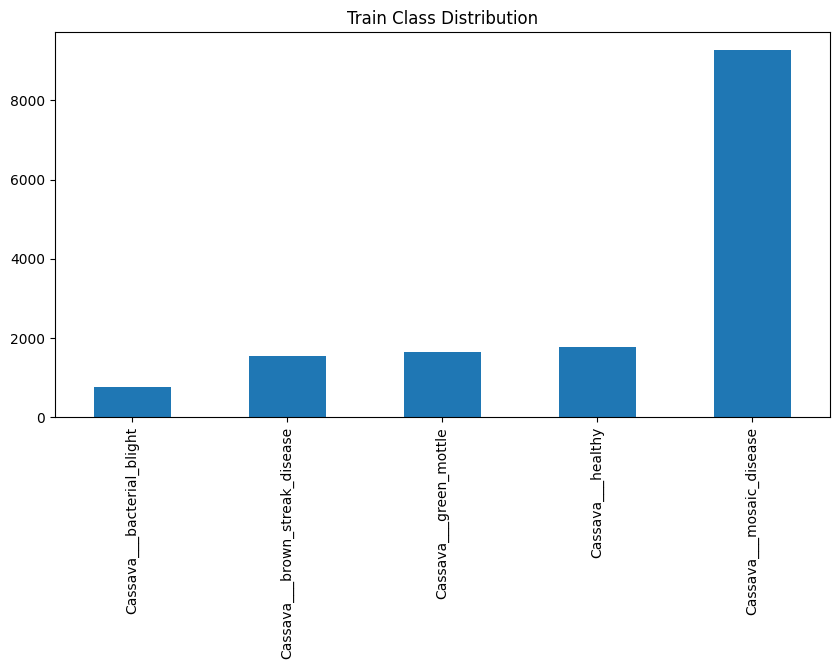
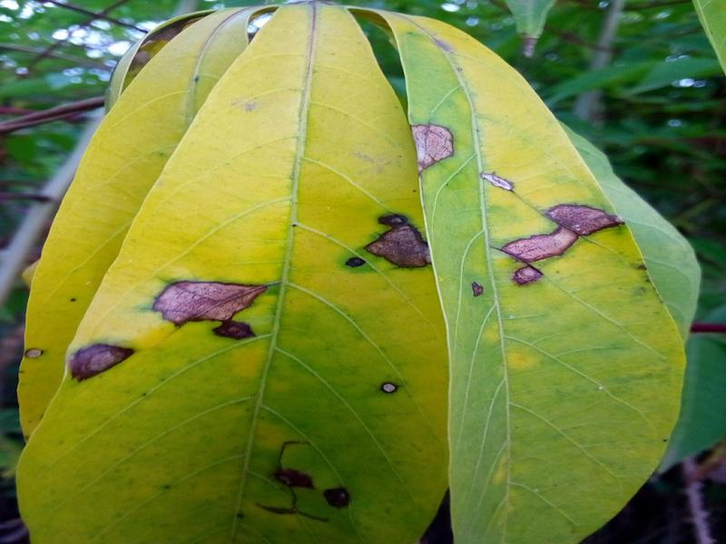
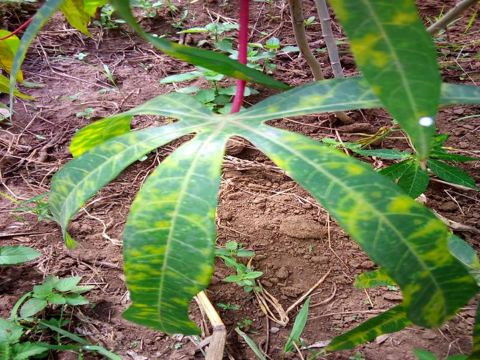
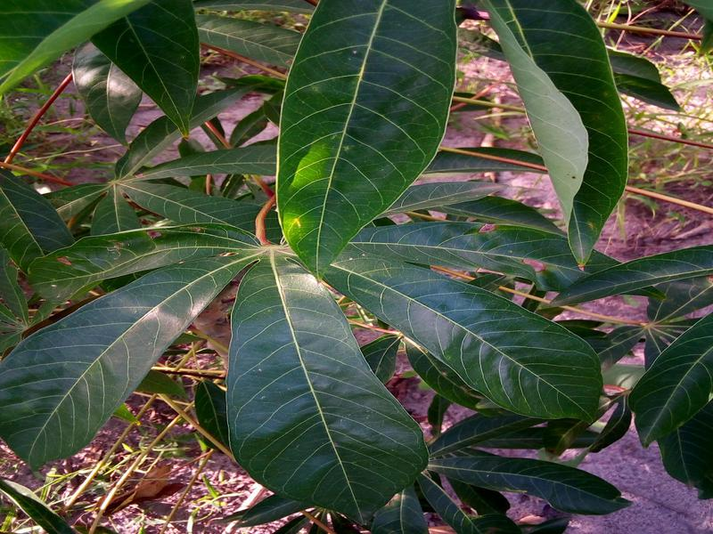

## 🧬 Aperçu du Dataset

Le dataset est constitué de **X images** de feuilles de manioc classées en **8 catégories** de santé/maladies.  
Chaque image a été annotée manuellement et prétraitée pour entraîner un modèle de classification.

- 📦 Total d'images : **X**
- 📂 Classes : **5**
- 🖼️ Taille normalisée : **224x224 pixels**

## 📊 Répartition des classes Pour le train

## Tableau résumé

| Classe                | Nombre d'images | Description courte                             | Exemple |
|-----------------------|------------------|------------------------------------------------|---------|
| Cassava Mosaic        | 13.2k              | Feuilles avec motifs marbrés irréguliers       |  |
| Cassava Bacterial Blight | 1087         | Feuilles perforées avec nécrose humide         |  |
| Cassava Healthy               | 2577              | Feuilles saines, vertes homogènes              |  |
|Cassava Brown Streak Disease               | 2189              | Taches brunes le long des nervures              |  |
| Cassava Green Mottle               | 2338           | Feuilles saines, vertes homogènes              |  |

Pour plus d'informtion veiller consulter 
[Kaggle](https://www.kaggle.com/datasets/nirmalsankalana/cassava-leaf-disease-classification?select=data)

mkdocs serve